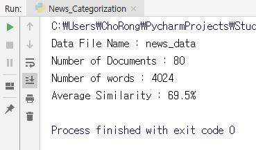

# Case Study[1] - News Categorization

이번 강의에서는 지금까지 배운 List Comprehension, Data Structure(Collections), Pythonic Code 작성법 등을 기반으로  다른 패키지 사용 없이 Python 만을 이용하여 한 뉴스에 대해 비슷한 뉴스를 찾아내도록 작성된 코드를 실행하면서, 설명하는 방식으로 진행되는 실습이다.

다음 강의 내용입니다. <https://www.edwith.org/aipython/lecture/23090/>

Core Keyword

> * Categorization
> * One-Hot Encoding
> * Bag of words
> * Cosine Distance
> * Corpus
> * List Comprehension


컴퓨터는 문자를 그대로 이해할 수 없다.

가장 기초적인 방법은 **"문자 -> 숫자"** 이다.

그렇다면 숫자끼리 유사하다는 것을 어떻게 표현할까? **유사하다 = 가깝다** 라고 정의를 한다.

숫자라고 한다면 좌표평면 위에 올려놓고 **비교** 한다면 가깝고 멀고를 확인 할 수 있다.

문자를 숫자로 만드는 방법은 무엇이 있을까?

바로 다음과 같은 방법이 있다.

**<< One-Hot Encoding [Bag of words]>>**

다음과 같은 방법을 사용하기 위해서는 먼저 Vector Space를 만든다.

즉, 벡터 공간인데

하나의 문서에있는 단어 하나하나를 요소로 갖는 리스트를 만들고 그 요소와 같은 단어가 존재하면 1 없으면 0

으로 표현하는 하나의 공간을 만들어준다.


**Q : 그렇다면 유사성은?**

1. Euclidian Distance

   이 방법은 피타고라스 정리의 의해서 두점 사이의 직선의 거리를 구하는 방법을 말한다

2. Cosine Distance

   이 방법은 두점 사이의 각도를 사용해서 얼만큼의 각도가 벌어져있는가? 를 보고 유사성을 본다


실제로 문서안의 단어에 대한 유사성을 구할때는 Cosine Distance를 사용해서 구한다.

예를들어

Love 와 Hate 만 들어있는 문서가 있다고 치자

문서1 의 내용이 "Love Love Love Love Hate" 라면 (4,1) 로 표현되고

문서2 의 내용이 "Love Hate Hate Hate Hate" 라면 (1,4) 로 표현되고

문서3 의 내용이 "Love Love Love Love Love" 라면 (5,0) 로 표현된다


그러면 2차원 좌표평면에서 봤을때 

문서 1의 내용은 문서 2보다 문서 3과 더 유사하다는 것을 알 수 있다.


이제 실제 실습을 들어가자 실습 Process(순서)는 다음과 같다.

> 1. 파일을 불러오기
> 2. 파일을 읽어서 단어사전 (corpus) 만들기
> 3. 단어별로 INDEX 만들기
> 4. 만들어진 인덱스로 문서별로 Bag of words vector 생성
> 5. 비교하고자 하는 문서 비교하기
> 6. 얼마나 맞는지 측정하기


### 1. 파일 불러오기

먼저 파일을 불러오는 소스코드를 확인해보자

```{python}
import os

# 파일들을 다 가져오는 함수
def get_file_list(dir_name):
    return os.listdir(dir_name)

# 가져온 파일들을 file_list 라는 리스트타입의 변수에 저장하게 된다.
# 이때 모든 파일들은 상대경로를 갖는데 os 타입에 따라서 구분자가 \ 혹은 / 이므로
# 프로그램이 구동되는 os에 맞게 join을 해주기 위해서 os.path.join 을 사용한다.

if __name__ == "__main__":
    dir_name = "news_data"
    file_list = get_file_list(dir_name)
    file_list = [os.path.join(dir_name, file_name) for file_name in file_list]
```

이때 주의해야 할 점은 내가 실행 시키고자 하는 .py 소스코드 파일이 위치한 경로에 news_data를 넣어주어야 한다는 점이다!! 항상 데이터를 처리할때 이 점을 유의하자.


### 2. 파일을 읽어서 단어사전(corpus) 만들기

두번째 단계인 파일별로 내용 읽기 파트입니다.

```{python}
#2. 파일별로 내용읽기 >> dict type 을 야구는 0 축구는 1로 설정한다.
def get_conetents(file_list):
    x_text = []
    y_class = []
    class_dict = { 1: "0" , 2: "0", 3: "0" , 4: "0" , 5: "1" , 6: "1" , 7: "1" , 8: "1"}

    for file_name in file_list:
        try:
            f = open(file_name, "r", encoding="cp949")
            category = int(file_name.split(os.sep)[1].split("_")[0])
            y_class.append(class_dict[category])
            x_text.append(f.read())
            f.close()
        except UnicodeDecodeError as e :
            print(e)
            print(file_name)
    return x_text, y_class
```

다음 소스코드는 내가 가지고 있는 DATA file 의 카테고리를 나누기 위해서 정의 되었다.

내가가진 파일은 1~8 까지 운동선수들과  그선수에 관한 각각 10개씩의 뉴스가 담겨있다.

이때 1~4번은 야구선수이고 5~8번은 축구선수이다.

따라서 야구선수면 0을 축구선수면 1을 출력하여 카테고리를 나누고

파일을 연다음에 x_text 에는 파일을 열어서 읽어내는 방식으로 y_class 에는 카테고리 리스트가 담기게 된다.

```{python}
    x_text, y_class = get_conetents(file_list)
```

이렇게 정의한 함수를 사용하기 위해서 다음의 소스코드 문장을 사용한다. 다만 다음 문장은 앞선 문장에 이어서 if문안에 넣어준다.

따라서 함수를 제외한 사실적인 Process는 다음과 같다.

```{python}
if __name__ == "__main__":
    dir_name = "news_data"
    file_list = get_file_list(dir_name)
    file_list = [os.path.join(dir_name, file_name) for file_name in file_list]
    
    x_text, y_class = get_conetents(file_list)
```


### 3. 단어별로 INDEX 만들기

Corpus를 만드는데 우리가 가진 80개의 문서에 포함된 모든 단어를 추출해내는 함수를 만든다.

먼저 모든 문서에 포함된 의미없는 문장부호를 제거하고 모든 단어를 소문자로 표현하는 함수를 만든다.

```{python}
# 아래 함수는 문장에 있는 의미없는 문장부호들을 삭제시켜준다.
def get_cleaned_text(word):
    import re
    word = re.sub('\W+', '', word.lower())
    return word
```

다음과 같은 함수를 만들었다.

그리고 이제 80개의 문서중 한문서에 있는 문장을 split 해줘서 2차원 형태로 갖는 배열을 만들고

그것을 다시 1차원 형태로 바꿔준다.

즉 다음과 같은 함수를 만든다.

```{python}
def get_corpus_dict(text):
    text = [sentence.split() for sentence in text]
    cleaned_words = [get_cleaned_text(word) for words in text for word in words]

    from collections import OrderedDict
    corpus_dict = OrderedDict()
    for i, v in enumerate(set(cleaned_words)):
        corpus_dict[v] = i
    return corpus_dict
```

그 뒤에 이제 처리부분에 가서 다음의 문장을 넣어준다

```{python}
    corpus = get_corpus_dict(x_text)
    print(corpus)
    print("Number of words : {0}".format(len(corpus)))
```

위 문장을 해석하면

corpus 라는 변수를 만들고 위에서 우리가 만든 문서중 단어를 추출하여 1차원 형태로 마들어주는get_corpus_dict 라는 함수를 사용해서 단어들을 1차원 배열 dict 형태로 corpus 라는 변수에 넣어주고

그것을 출력해보고

corpus 안에 몇개의 단어가 있는지 확인하는 소스코드다

다음 소스코드 또한 앞서만든 main 처리 코드 뒤에 붙여준다.

```{python}
if __name__ == "__main__":
    dir_name = "news_data"
    file_list = get_file_list(dir_name)
    file_list = [os.path.join(dir_name, file_name) for file_name in file_list]
    x_text, y_class = get_conetents(file_list)
    
    corpus = get_corpus_dict(x_text)
    print(corpus)
    print("Number of words : {0}".format(len(corpus)))
```

(!) 이때 앞서 적어놓은 단순히 결과를 확인하기 위한 소스코드는 삭제했다.


### 4. 만들어진 인덱스로 문서별로 Bag of words vector 생성

이제 만들어놓은 4024개의 벡터를 처리하기 위해서 벡터 공간을 만들어준다. 먼저 다음과 같은 함수를 정의한다.

```{python}
def get_count_vector(text, corpus):
    text = [sentence.split() for sentence in text]
    word_number_list = [[corpus[get_cleaned_text(word)] for word in words] for words in text]
    X_vector = [[0 for _ in range(len(corpus))] for x in range(len(text))]

    for i, text in enumerate(word_number_list):
        for word_number in text:
            X_vector[i][word_number] += 1
    return X_vector
```

다음 함수를 보자 다음함수를 보면 앞서 단어별로 split하는 함수처럼 생겼지만 한가지 더해서

여기에서는 단어의 dict 번호 (index number)를 추출한다. 그리고 0으로 가득찬 4024 * 80의 벡터공간을 

만든다음에 거기에 어떤 단어가 나올때마다 +1 씩 해주는 식의 구성이다.

따라서 다음의 문장을 main 실행 소스코드에 넣어준다.

```{python}
x_vector = get_count_vector(x_text, corpus)
print(x_vector[0])
```

두 번째 소스코드는 단순하게 x_vector의 출력을 확인하기 위한 줄이다. 따라서 총 처리 소스코드는 다음과 같다.

```{python}
if __name__ == "__main__":
    dir_name = "news_data"
    file_list = get_file_list(dir_name)
    file_list = [os.path.join(dir_name, file_name) for file_name in file_list]
    x_text, y_class = get_conetents(file_list)
    corpus = get_corpus_dict(x_text)
    print("Number of words : {0}".format(len(corpus)))
    
    x_vector = get_count_vector(x_text, corpus)
    print(x_vector[0])
```


### 5.비교하고자 하는 문서 비교하기

이제 10개의 파일을 중심으로 서로 비교하는 부분이다.  앞에까지는 dict와 corpus를 구성하는 단계였다면 사실상 이 프로그램의 메인이라고 볼 수 있다.


다음은 코사인 유사도 공식이다. 암기할 필요는 없지만 하나의 Trick이니까 알아 두도록 하자. 다음 소스코드는

위 공식을 코드화 한 코드이다.

```{python}
import math
def get_cosine_similarity(v1 ,v2):
    "compute cosine similarity of v1 to v2 : (v1 dot v2) / {||v1|| * ||v2||}"
    sumxx, sumxy, sumyy = 0, 0, 0
    for i in range(len(v1)):
        x = v1[i]; y = v2[i]
        sumxx += x*x
        sumxy += x*y
        sumyy += y*y
    return sumxy/math.sqrt(sumxx*sumyy) 
```

다음으로 우리가 갖고있는 80개의 문서와 10번 문서를 각각 비교하여 얼마나 비슷한지 유사도를 측정하는 함수이다.

```{python}
#비교후 유사도 결과를 정리하는 함수
def get_similarity_score(x_vector, source):
    source_vector = x_vector[source]
    similarity_list = []
    for target_vector in x_vector:
        similarity_list.append(get_cosine_similarity(source_vector, target_vector))
    return similarity_list
```

위 함수를 보면 souce(기준)문서와 나머자 80개의 문서를 각각 비교한뒤에 similarity_list 라는 배열에다가 유사도를 append하는 방식이다

총 similarity_list는 80개의 배열요소를 갖는다. 이제 확인 및 적용을 위해서 main 소스로 가자

```{python}
    #비교의 기준이 되는 문서
    source_number = 10
    
    result =[]

    for i in range(80):
        source_number = i
        similarity_score = get_similarity_score(x_vector, source_number)

    print(similarity_score)
```

다음의 내용을 main 소스에 넣어준다 그렇게 되면 총 80개의 문서의 유사도가 측정되어 print 된다.

따라서 다음을 삽입한 processing code 는 다음과 같다.

```{python}
if __name__ == "__main__":
    dir_name = "news_data"
    file_list = get_file_list(dir_name)
    file_list = [os.path.join(dir_name, file_name) for file_name in file_list]
    x_text, y_class = get_conetents(file_list)
    corpus = get_corpus_dict(x_text)
    print("Number of words : {0}".format(len(corpus)))
    x_vector = get_count_vector(x_text, corpus)
    print(x_vector[0])
    
    #비교의 기준이 되는 문서
    source_number = 10
    
    result =[]
    for i in range(80):
        source_number = i
        similarity_score = get_similarity_score(x_vector, source_number)
        
    print(similarity_score)
```


### 6. 얼마나 맞는지 측정하기

다음은 이어서 비교결과를 정리하는 함수이다.

10번 문서(기준)와 유사도가 가장큰 즉 가장 유사한 문서 n개를 뽑는 함수이다.

```{python}
#비교후 유사도가 가장 큰 값 10개를 정리하는 함수
def get_top_n_similarity_news(similarity_score, n):
    import operator
    x = { i : v for i, v in enumerate(similarity_score)}
    sorted_x = sorted(x.items(), key=operator.itemgetter(1))

    return list(reversed(sorted_x))[1 : n+1]
```

다음 함수를 보면 인덱스 번호와 dict 타입을 활용해서 유사도가 가장큰 문서의 인덱스(문서번호)를 출력하고 그리고 유사도를 보여주는 방식으로 총 n개의 유사한 문서를 출력한다.

이렇게 함수를 만든다음에 다음과 같은 내용을 main 소스에 추가한다.

```{python}
similarity_news = get_top_n_similarity_news(similarity_score, 10)
```

다음은 위 소스코드를 추가한 총 main processing 소스코드이다.

```{python}
if __name__ == "__main__":
    dir_name = "news_data"
    file_list = get_file_list(dir_name)
    file_list = [os.path.join(dir_name, file_name) for file_name in file_list]
    x_text, y_class = get_conetents(file_list)
    corpus = get_corpus_dict(x_text)
    print("Number of words : {0}".format(len(corpus)))
    x_vector = get_count_vector(x_text, corpus)
    print(x_vector[0])

    #비교의 기준이 되는 문서
    source_number = 10

    result =[]
    for i in range(80):
        source_number = i
        similarity_score = get_similarity_score(x_vector, source_number)
        similarity_news = get_top_n_similarity_news(similarity_score, 10)

    print(similarity_news)
```


마지막으로 data 전체가 평균적으로 얼만큼의 유사도를 갖는지 나타내는 함수를 만들어보자.

```{python}
def get_accuracy(similarity_list, y_class, source_news):
    source_class = y_class[source_news]

    return sum([source_class == y_class[i[0]] for i in similarity_list]) / len(similarity_list)
```

다음 함수의 리턴값을 보면 모든 문서의 유사도를 더한다음에 그것을 갯수로 나누어서 평균 값을 구한다.

그리고 다음의 소스코드를 이전의 main 실행 소스에 넣어준다.

```{python}
		accuracy_score = get_accuracy(similarity_news, y_class, source_number)
        result.append(accuracy_score)

   print("Total Similarity : {0}%".format((sum(result)/80)*100))
```

따라서 위의 결과를 총 합한 main processing 소스코드는 다음과 같다.

```{python}
if __name__ == "__main__":
    dir_name = "news_data"
    file_list = get_file_list(dir_name)
    file_list = [os.path.join(dir_name, file_name) for file_name in file_list]
    x_text, y_class = get_conetents(file_list)
    corpus = get_corpus_dict(x_text)
    print("Number of words : {0}".format(len(corpus)))
    x_vector = get_count_vector(x_text, corpus)

    result =[]
    for i in range(80):
        source_number = i
        similarity_score = get_similarity_score(x_vector, source_number)
        similarity_news = get_top_n_similarity_news(similarity_score, 10)
        accuracy_score = get_accuracy(similarity_news, y_class, source_number)
        result.append(accuracy_score)

    print("Total Similarity : {0}%".format((sum(result)/80)*100))
```


## Final . 총 소스코드 와 실행결과

```{python}
'''
2019 - 02 - (09 ~ 12)
Project name : News Categorization & Measure Average Similarity of Data file
Type : chapter 1 - Case study
Join : DevChorong(is Github ID)
IDE : this program was written in Pycharm
OS : Windows 10
'''

import os

#1.파일불러오기 >>  파일들을 다 가져오는 함수
def get_file_list(dir_name):
    return os.listdir(dir_name)

#2. 파일별로 내용읽기 >> dict type 을 야구는 0 축구는 1로 설정한다.
def get_conetents(file_list):
    x_text = []
    y_class = []
    class_dict = { 1: "0" , 2: "0", 3: "0" , 4: "0" , 5: "1" , 6: "1" , 7: "1" , 8: "1"}

    for file_name in file_list:
        try:
            f = open(file_name, "r", encoding="cp949")
            category = int(file_name.split(os.sep)[1].split("_")[0])
            y_class.append(class_dict[category])
            x_text.append(f.read())
            f.close()
        except UnicodeDecodeError as e :
            print(e)
            print(file_name)
    return x_text, y_class

#3 Corpus만들기 + 단어별 index 생성하기
# 아래 함수는 문장에 있는 의미없는 문장부호들을 삭제시켜준다.
def get_cleaned_text(word):
    import re
    word = re.sub('\W+', '', word.lower())
    return word

def get_corpus_dict(text):
    text = [sentence.split() for sentence in text]
    cleaned_words = [get_cleaned_text(word) for words in text for word in words]

    from collections import OrderedDict
    corpus_dict = OrderedDict()
    for i, v in enumerate(set(cleaned_words)):
        corpus_dict[v] = i
    return corpus_dict

#4. 문서별로 Bag of words vector 생성
def get_count_vector(text, corpus):
    text = [sentence.split() for sentence in text]
    word_number_list = [[corpus[get_cleaned_text(word)] for word in words] for words in text]
    X_vector = [[0 for _ in range(len(corpus))] for x in range(len(text))]

    for i, text in enumerate(word_number_list):
        for word_number in text:
            X_vector[i][word_number] += 1
    return X_vector

#5. 비교하기 단계
#먼저 유사도를 측정하기위해서 "Cosine similarity"공식을 소스코드화 한다.
import math
def get_cosine_similarity(v1 ,v2):
    "compute cosine similarity of v1 to v2 : (v1 dot v2) / {||v1|| * ||v2||}"
    sumxx, sumxy, sumyy = 0, 0, 0
    for i in range(len(v1)):
        x = v1[i]; y = v2[i]
        sumxx += x*x
        sumxy += x*y
        sumyy += y*y
    return sumxy/math.sqrt(sumxx*sumyy)

# 6. 비교후 유사도 결과를 정리하는 함수
def get_similarity_score(x_vector, source):
    source_vector = x_vector[source]
    similarity_list = []
    for target_vector in x_vector:
        similarity_list.append(get_cosine_similarity(source_vector, target_vector))
    return similarity_list

#비교후 유사도가 가장 큰 값 10개를 정리하는 함수
def get_top_n_similarity_news(similarity_score, n):
    import operator
    x = { i : v for i, v in enumerate(similarity_score)}
    sorted_x = sorted(x.items(), key=operator.itemgetter(1))

    return list(reversed(sorted_x))[1 : n+1]

#문서의 평균 유사도를 구하는 함수이다.
def get_accuracy(similarity_list, y_class, source_news):
    source_class = y_class[source_news]

    return sum([source_class == y_class[i[0]] for i in similarity_list]) / len(similarity_list)

# 가져온 파일들을 file_list 라는 리스트타입의 변수에 저장하게 된다.
# 이때 모든 파일들은 상대경로를 갖는데 os 타입에 따라서 구분자가 \ 혹은 / 이므로
# 프로그램이 구동되는 os에 맞게 join을 해주기 위해서 os.path.join 을 사용한다.

if __name__ == "__main__":
    dir_name = "news_data"
    print("Data File Name : {0}".format(dir_name))
    
    file_list = get_file_list(dir_name)
    file_list = [os.path.join(dir_name, file_name) for file_name in file_list]
    x_text, y_class = get_conetents(file_list)
    print("Number of Documents : {0}".format(len(x_text)))

    corpus = get_corpus_dict(x_text)
    print("Number of words : {0}".format(len(corpus)))

    x_vector = get_count_vector(x_text, corpus)

    result =[]
    for i in range(80):
        source_number = i
        similarity_score = get_similarity_score(x_vector, source_number)
        similarity_news = get_top_n_similarity_news(similarity_score, 10)
        accuracy_score = get_accuracy(similarity_news, y_class, source_number)
        result.append(accuracy_score)

    print("Average Similarity : {0}%".format((sum(result)/80)*100))
    
```

<결과>




## Epilogue. Project를 마치며..

이 프로젝트는 순수하게 Data_processing 을 공부하면서 **edwith 최성철교수님의 "머신러닝을 위한 Python 워밍업"** 이라는 수업을 들으면서 기획하였다. 교수님의 강의를 천천히 따라가면서한 프로젝트라 100% 내 아이디어와 힘으로 만든 프로젝트는 아니지만 그래도 의미있던 프로젝트였다. 앞으로 내가 머신러닝을 배우던 데이터 처리를 배우던 딥러닝, 인공지능을 배우던 간에 이번 프로젝트를 시작으로 기죽지 않고 힘내서 공부 할 수 있을 것 같다.

